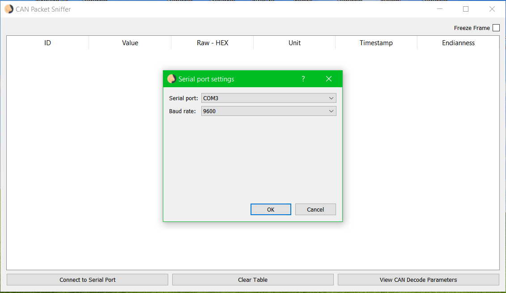
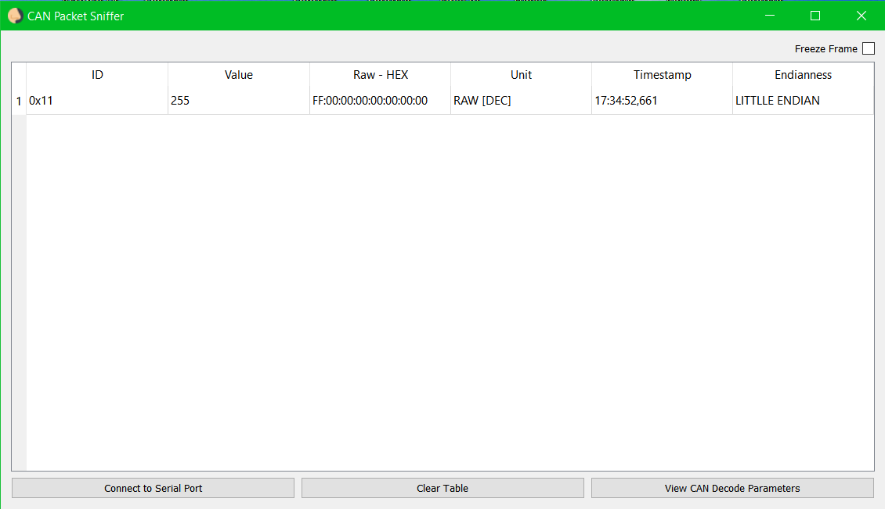
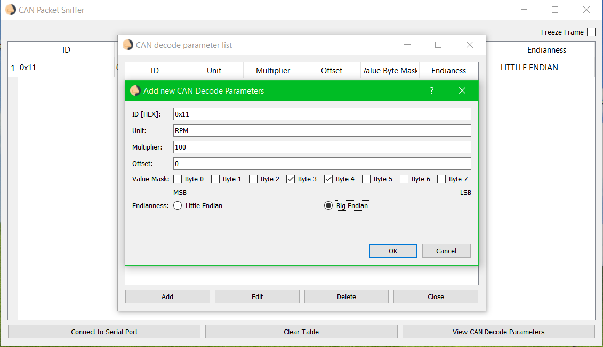
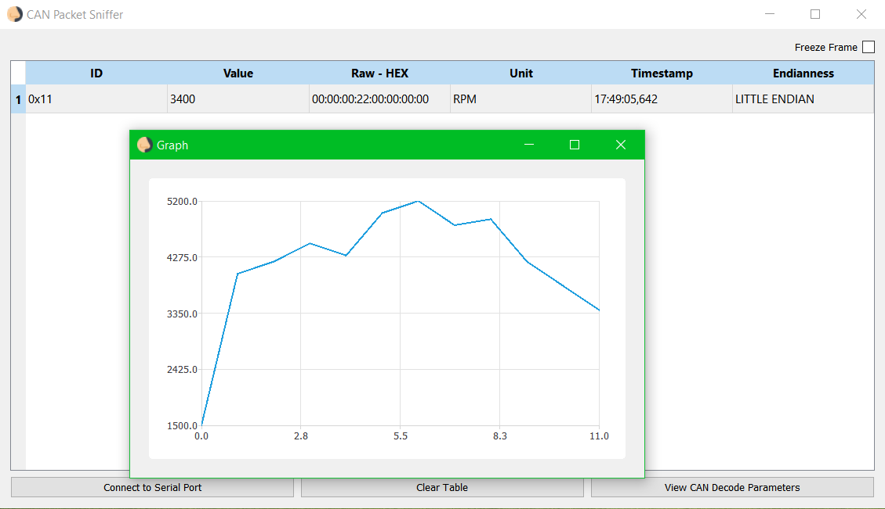
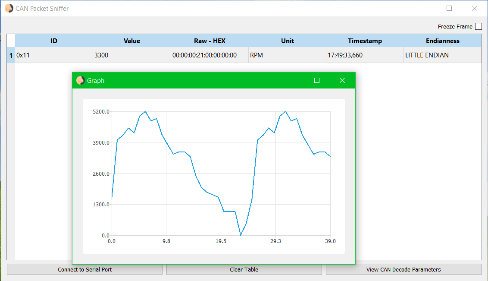
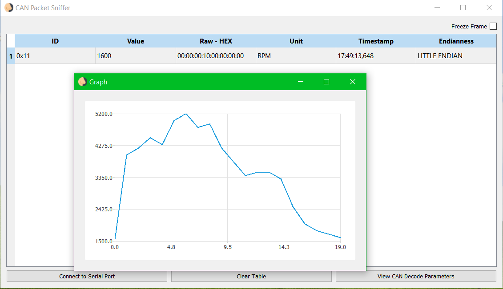

CAN Packer Sniffer (Backend)
=============

### Authors

- Petar Kaselj
- Josip Nigojevic
 
---

### Documentation

- [Technical Documentation (HR)](resources/CAN%20Packet%20Sniffer.pdf)

---

### Motivation

This project was developed as part of the _Automotive Diagnostics_ university course at _FESB (Faculty of Electrical Engineering, Mechanical Engineering and Naval Architecture)_ at _University of Split_ held by associates from _Rimac Automobili_.

---

### Description

The project consists of C++ Arduino fronted (source not available) that acts as an interface to the CAN network, reading CAN packets and sending them over UART to the C++ Qt backend application (source in current repo) that then decodes them according to rules set by the user and plots data.

---

### Features
- Configurable UART settings
- Simple custom UART synchronization protocol (In-band Start/Stop Markers)
- Data decode rules
    - Endianness
    - Byte mask (use only some of the bytes to decode data)
    - Unit
- Live plot
- Freeze frame

---

### Screenshots

##### Serial Setup

##### Undecoded Data Display

##### Setting Decode Rules

##### Decoded Data Display (and live Plot on double click)

---

### Dependencies

-	Qt 5
-	Arduino IDE

